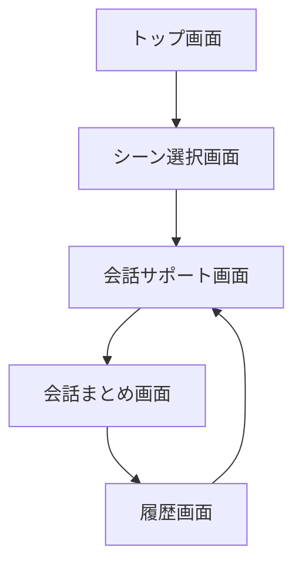
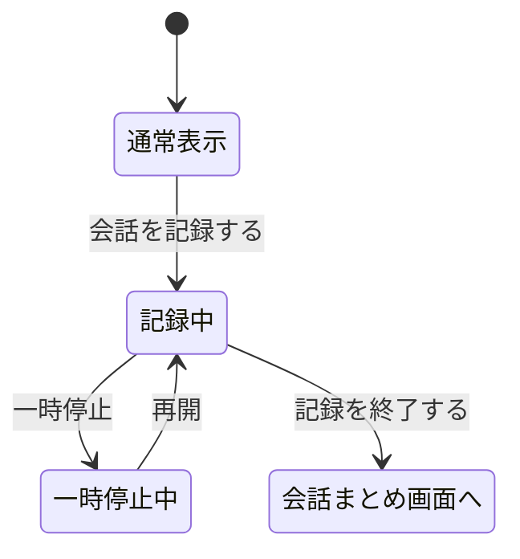

# UI/UX設計書：待ち時間会話支援AIシステム

作成者：Yuki  
対象システム：待ち時間トークAI  
対象端末：スマートフォン  

---

## 1. システム概要

本システムは、飲食店やライブ会場、イベント会場などで発生する待ち時間に、AIが会話の話題を提案し、会話を楽しく続けられるように支援するスマートフォン向けシステムである。

ユーザーは、現在いる場所、一緒にいる相手との関係性、今の気分を選択する。AIはその情報をもとに、状況に合った会話の話題を提示する。また、提示された話題は画面表示だけでなく、音声で自動読み上げされる。

さらに、ユーザーが会話を記録したい場合は、会話サポート画面内で記録を開始できる。記録終了後、AIが会話内容を要約し、盛り上がった話題や次におすすめの話題を表示する。

---

## 2. 開発目的

待ち時間では、会話が止まってしまったり、同行者同士がそれぞれスマートフォンを見てしまったりすることがある。本システムでは、そのような待ち時間を、AIによって会話が生まれる時間に変えることを目的とする。

### 目的

- 待ち時間の退屈さを減らす
- 会話のきっかけを作る
- 会話を自然に続けやすくする
- 会話内容を記録・要約して思い出として残す
- スマホ画面を見続けなくても音声で話題を共有できるようにする

---

## 3. 想定ユーザー

| ユーザー | 利用例 |
|---|---|
| 友人同士 | 飲食店やライブの待ち時間に会話を盛り上げる |
| 恋人 | デート中の待ち時間に話題を出す |
| 家族 | 外出先で子どもや家族と会話する |
| 初対面の人 | 会話のきっかけが少ない場面で使う |
| グループ | イベントや旅行中に話題を共有する |

---

## 4. UXコンセプト

### コンセプト

**「待ち時間を、会話が生まれる時間に変えるAI」**

本システムでは、ユーザーが細かい文章を入力しなくても、選択操作だけでAIが会話の話題を作る。スマートフォンに慣れていない人でも使いやすいように、ボタンを大きくし、操作数を少なくする。

### UX方針

| 方針 | 内容 |
|---|---|
| すぐ使える | 3タップ程度で話題を表示できる |
| 見やすい | 文字を大きく、カード形式で表示する |
| 聞きやすい | 話題は自動で音声読み上げする |
| 迷わない | ボタンの役割を短い言葉で表す |
| 安心できる | 録音・記録はユーザーが操作した場合のみ行う |
| 画面遷移を減らす | 記録中画面を作らず、会話サポート画面内で記録状態にする |

---

## 5. 画面構成

本システムのフロントエンドは、以下の5画面で構成する。

| No. | 画面名 | 役割 |
|---|---|---|
| 1 | トップ画面 | アプリの説明と開始 |
| 2 | シーン選択画面 | 場所・関係性・気分を選ぶ |
| 3 | 会話サポート画面 | 話題表示、音声読み上げ、会話記録 |
| 4 | 会話まとめ画面 | AIによる要約、盛り上がった話題の表示 |
| 5 | 履歴画面 | 過去の会話ログを確認 |

※記録中専用画面は作成しない。会話サポート画面内で記録中の表示に切り替える。

---

## 6. 画面遷移図



### 会話サポート画面内の状態遷移



---

## 7. 各画面のUI設計

---

## 7.1 トップ画面

### 目的

アプリの概要を伝え、ユーザーがすぐに利用を開始できるようにする。

### 表示内容

- アプリ名
- アプリアイコン
- 簡単な説明文
- はじめるボタン

### 画面イメージ

```text
--------------------------------
待ち時間トークAI

待ち時間に、
AIが会話の話題を提案します。

[ はじめる ]
--------------------------------
```

### UIポイント

- 中央にアプリ名とアイコンを大きく配置する
- 「はじめる」ボタンを画面下部に大きく配置する
- 説明文は短くし、すぐに使える印象にする

---

## 7.2 シーン選択画面

### 目的

AIが適切な話題を作るために、現在の状況を選択する。

### 表示内容

- 場所を選ぶ
- 関係性を選ぶ
- 気分を選ぶ
- 話題を作るボタン

### 選択項目

#### 場所

- 飲食店
- ライブ
- イベント
- テーマパーク

#### 関係性

- 友人
- 恋人
- 家族
- 初対面

#### 気分

- 楽しく
- 落ち着いて
- 盛り上げたい
- 暇つぶし

### 画面イメージ

```text
--------------------------------
シーン選択

場所を選ぶ
[ 飲食店 ] [ ライブ ] [ イベント ] [ テーマパーク ]

関係性を選ぶ
[ 友人 ] [ 恋人 ] [ 家族 ] [ 初対面 ]

気分を選ぶ
[ 楽しく ] [ 落ち着いて ] [ 盛り上げたい ] [ 暇つぶし ]

[ 話題を作る ]
--------------------------------
```

### UIポイント

- 選択肢はカード型またはチップ型にする
- 選択中の項目は青色で強調する
- アイコンを使って直感的に選べるようにする
- 画面下部に「話題を作る」ボタンを固定すると使いやすい

---

## 7.3 会話サポート画面

### 目的

AIが会話の話題を表示し、音声で読み上げる。さらに、同じ画面内で会話記録を開始・停止できるようにする。

この画面が本システムの中心機能である。

---

### 通常時の表示内容

- AIおすすめ話題
- 話題カード
- 音声読み上げ状態
- もう一度読むボタン
- 深掘り質問ボタン
- 次の話題ボタン
- 会話を記録するボタン

### 通常時の画面イメージ

```text
--------------------------------
AIおすすめ話題

「今日一番楽しみにしていることは？」

🔊 AIが話題を読み上げています

[ もう一度読む ] [ 深掘り質問 ] [ 次の話題 ]

[ ● 会話を記録する ]
--------------------------------
```

---

### 記録中の表示内容

ユーザーが「会話を記録する」ボタンを押すと、別画面へ移動せず、同じ会話サポート画面内で記録状態に切り替わる。

表示内容は以下のように変更する。

- REC表示
- 記録時間
- 会話を記録中です、という状態表示
- 一時停止ボタン
- 記録を終了するボタン

### 記録中の画面イメージ

```text
--------------------------------
AIおすすめ話題

「今日一番楽しみにしていることは？」

🔊 AIが話題を読み上げています

[ もう一度読む ] [ 深掘り質問 ] [ 次の話題 ]

● REC  02:15
会話を記録中です

[ 一時停止 ] [ 記録を終了する ]
--------------------------------
```

---

### UIポイント

- 話題カードを最も目立つ位置に配置する
- 音声読み上げは標準機能として扱う
- 「音声で読む」ではなく「もう一度読む」とする
- 記録中でも話題カードは見えるようにする
- 記録中画面へ遷移させず、同じ画面内で状態表示を変える
- 記録中は赤色のREC表示を使い、状態を明確にする

---

## 7.4 会話まとめ画面

### 目的

記録した会話をAIが要約し、会話内容を後から見返しやすくする。

### 表示内容

- 今日の会話まとめ
- 会話の要約
- 盛り上がった話題
- 次のおすすめ話題
- 保存するボタン
- もう一度話題を出すボタン

### 画面イメージ

```text
--------------------------------
今日の会話まとめ

お気に入りのアーティストの曲や
ライブの思い出について話しました。

盛り上がった話題
・好きなアーティストとその曲
・ライブやコンサートの思い出
・旅行先で印象に残った場所
・次に行ってみたい場所

次のおすすめ話題
「最近ハマっていることは？」

[ 保存する ] [ もう一度話題を出す ]
--------------------------------
```

### UIポイント

- 長い会話内容をそのまま表示せず、要約を先に表示する
- 箇条書きで盛り上がった話題を見やすくする
- 次の会話につながる質問を表示する
- 保存ボタンと再提案ボタンを下部に配置する

---

## 7.5 履歴画面

### 目的

過去に記録した会話を一覧で確認できるようにする。

### 表示内容

- 会話履歴一覧
- 日付
- 場所カテゴリ
- 会話要約
- 詳細を見るボタン
- 下部ナビゲーション

### 画面イメージ

```text
--------------------------------
会話履歴

2026/06/16　ライブ会場
好きなアーティストやライブの思い出について話しました。
[ 詳細を見る ]

2026/06/10　飲食店
おすすめの食べ物や呼び方の話で楽しみました。
[ 詳細を見る ]

2026/06/02　イベント
イベント内容や準備の話で盛り上がりました。
[ 詳細を見る ]
--------------------------------
```

### UIポイント

- カード形式で履歴を並べる
- 日付と場所を目立たせる
- 内容は短く要約して表示する
- 詳細を見るボタンで詳細画面に移動できるようにする

---

## 8. コンポーネント設計

| コンポーネント名 | 使用画面 | 役割 |
|---|---|---|
| Header | 各画面 | 画面タイトル、戻る、設定などを表示 |
| PrimaryButton | 各画面 | 主要操作ボタン |
| SecondaryButton | 各画面 | 補助操作ボタン |
| SceneChip | シーン選択画面 | 場所・関係性・気分の選択 |
| TopicCard | 会話サポート画面 | AIの話題を表示 |
| VoiceStatus | 会話サポート画面 | 読み上げ状態を表示 |
| RecordingPanel | 会話サポート画面 | 記録中のREC表示、タイマー、停止ボタン |
| SummaryCard | 会話まとめ画面 | 会話要約を表示 |
| HistoryCard | 履歴画面 | 過去の会話ログを表示 |
| BottomNavigation | 履歴画面など | 主要画面への移動 |

---

## 9. デザイン方針

### カラー

| 用途 | 色のイメージ |
|---|---|
| メインカラー | 青 |
| 背景 | 白・薄い水色 |
| 強調 | 濃い青 |
| 記録中 | 赤 |
| 注意文 | グレーまたは薄い青 |

### デザインの方向性

- 青と白を基調にして、安心感と清潔感を出す
- 角丸カードを多く使い、柔らかい印象にする
- スマートフォン画面ではボタンを大きくする
- 文字は読みやすさを優先する
- アイコンを使って操作内容を分かりやすくする

---

## 10. 音声読み上げ機能の設計

会話サポート画面では、AIが話題を生成した直後に、話題を自動で読み上げる。

### 音声読み上げの流れ

```text
1. シーン選択画面で情報を選ぶ
2. 「話題を作る」を押す
3. AIが話題を生成する
4. 会話サポート画面に話題を表示する
5. 同時にAIが話題を音声で読み上げる
6. 聞き逃した場合は「もう一度読む」を押す
```

### UI上の表示

```text
🔊 AIが話題を読み上げています
```

### 注意点

スマートフォンでは自動音声再生が制限される場合がある。そのため、実装ではユーザーが「話題を作る」や「次の話題」を押したタイミングで音声を再生する形にする。

---

## 11. 会話記録機能の設計

### 基本方針

会話記録は、ユーザーが「会話を記録する」を押した場合のみ開始する。常時録音は行わない。

### 記録開始後の変化

| 通常時 | 記録中 |
|---|---|
| 会話を記録する | REC表示 |
| 通常ボタン表示 | タイマー表示 |
| 記録なし | 一時停止・記録終了ボタン表示 |

### 記録終了後

「記録を終了する」を押すと、会話まとめ画面に移動する。会話内容はAIによって要約される。

---

## 12. プライバシー・安全面

音声や会話内容を扱うため、プライバシーへの配慮が必要である。

### 対応方針

| 課題 | 対応 |
|---|---|
| 無断録音 | 記録開始前にユーザー操作を必須にする |
| 周囲の会話の混入 | 注意文を表示する |
| ライブ会場などの録音禁止 | 録音禁止場所では使わない注意を表示する |
| 個人情報 | 履歴削除機能を用意する |
| 保存の不安 | 保存する/保存しないを選べるようにする |

### 注意文の例

```text
周囲の迷惑にならないようご配慮ください。
録音する前に相手の同意を得ましょう。
```

---

## 13. フロントエンドファイル構成案

HTML/CSS/JavaScriptで作成する場合の構成は以下の通り。

```text
wait-talk-ai/
├── index.html          // トップ画面
├── scene.html          // シーン選択画面
├── talk.html           // 会話サポート画面
├── summary.html        // 会話まとめ画面
├── history.html        // 履歴画面
│
├── css/
│   └── style.css
│
├── js/
│   ├── index.js
│   ├── scene.js
│   ├── talk.js
│   ├── summary.js
│   └── history.js
```

### 記録中画面について

`recording.html` は作成しない。記録中の処理は `talk.html` と `talk.js` 内で行う。

---

## 14. JavaScriptの状態管理案

会話サポート画面では、記録状態を変数で管理する。

```javascript
let isRecording = false;
let isPaused = false;
let recordingSeconds = 0;
```

### 状態による表示切り替え

| 状態 | 表示 |
|---|---|
| isRecording = false | 「会話を記録する」ボタンを表示 |
| isRecording = true | REC、タイマー、一時停止、記録終了を表示 |
| isPaused = true | 「再開」ボタンを表示 |

---

## 15. API設計案

### 話題生成API

```text
POST /topics/generate
```

送信データ例：

```json
{
  "place": "live",
  "relationship": "friend",
  "mood": "fun"
}
```

返却データ例：

```json
{
  "topic": "今日一番楽しみにしていることは？",
  "follow_up": [
    "それを楽しみにしている理由は？",
    "終わった後に一番話したいことは？"
  ]
}
```

---

### 会話要約API

```text
POST /conversations/summary
```

送信データ例：

```json
{
  "transcript": "今日はライブで好きな曲や旅行先について話した。"
}
```

返却データ例：

```json
{
  "summary": "ライブの思い出や旅行先について話し、次に行きたい場所の話で盛り上がった。",
  "keywords": ["ライブ", "好きな曲", "旅行"],
  "next_topic": "最近ハマっていることは？"
}
```

---

## 16. データベース設計案

### conversations テーブル

| カラム名 | 内容 |
|---|---|
| id | 会話ID |
| place_type | 場所カテゴリ |
| relationship_type | 関係性 |
| mood_type | 気分 |
| transcript | 会話テキスト |
| summary | AI要約 |
| created_at | 作成日時 |

### topics テーブル

| カラム名 | 内容 |
|---|---|
| id | 話題ID |
| place_type | 場所カテゴリ |
| topic_text | 話題文 |
| created_at | 作成日時 |

### favorites テーブル

| カラム名 | 内容 |
|---|---|
| id | お気に入りID |
| topic_id | 話題ID |
| created_at | 作成日時 |

---

## 17. 最終的な操作の流れ

```text
1. トップ画面で「はじめる」を押す
2. シーン選択画面で場所・関係性・気分を選ぶ
3. 「話題を作る」を押す
4. 会話サポート画面でAIの話題が表示される
5. 話題が自動で読み上げられる
6. 必要に応じて「深掘り質問」や「次の話題」を使う
7. 会話を残したい場合は「会話を記録する」を押す
8. 同じ画面内でREC表示とタイマーが表示される
9. 「記録を終了する」を押す
10. 会話まとめ画面でAI要約を見る
11. 必要なら保存する
12. 履歴画面で過去の会話を確認する
```

---

## 18. まとめ

本システムは、待ち時間における会話のきっかけ不足を解決するためのスマートフォン向けAI会話支援システムである。

フロントエンドは、トップ画面、シーン選択画面、会話サポート画面、会話まとめ画面、履歴画面の5画面で構成する。中心となる会話サポート画面では、AIの話題表示、音声読み上げ、深掘り質問、次の話題、会話記録を1画面にまとめる。

記録中専用画面は作らず、会話サポート画面内で記録状態を表示することで、画面遷移を減らし、待ち時間中でも使いやすいUI/UXを実現する。
