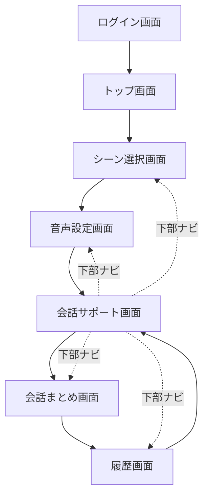
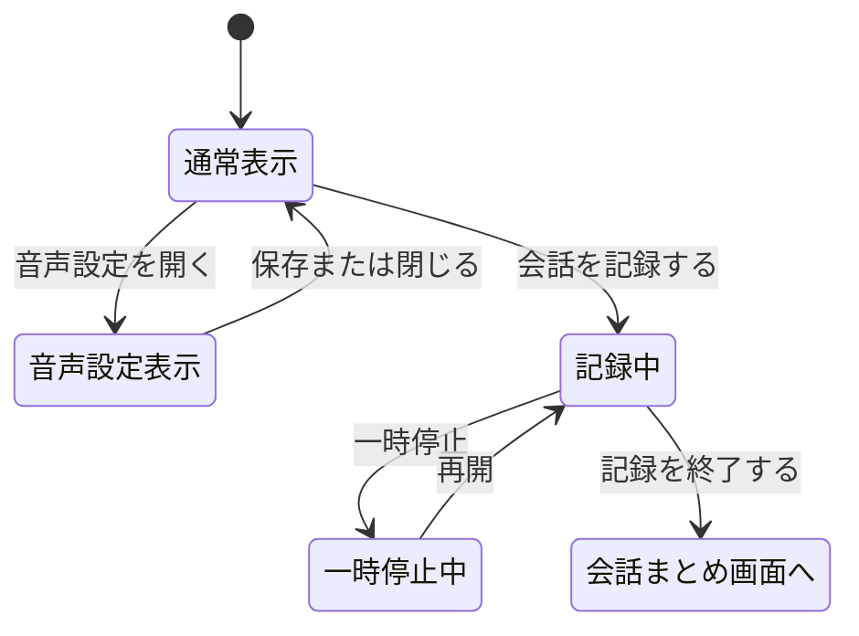

# UI/UX設計書：待ち時間会話支援AIシステム

作成者：Yuki  
対象システム：待ち時間トークAI  
対象端末：スマートフォン  
資料範囲：フロントエンドのUI/UX設計のみ  

---

## 1. システム概要

本システムは、飲食店やライブ会場、イベント会場などで発生する待ち時間に、AIが会話の話題を提案し、会話を楽しく続けられるように支援するスマートフォン向けシステムである。

ユーザーは、現在いる場所、一緒にいる相手との関係性、今の気分を選択する。AIはその情報をもとに、状況に合った会話の話題を提示する。提示された話題は画面表示だけでなく、音声で自動読み上げされる。

また、音声読み上げはユーザーの好みに合わせて変更できる。音声設定では、音声タイプ、話速、音量を調整できるようにする。

さらに、ユーザーが会話を記録したい場合は、会話サポート画面内で記録を開始できる。記録中専用画面は作成せず、同じ画面内で記録状態を表示する。記録終了後、会話まとめ画面でAIによる会話要約を確認できる。

---

## 2. 開発目的

待ち時間では、会話が止まってしまったり、同行者同士がそれぞれスマートフォンを見てしまったりすることがある。本システムでは、そのような待ち時間を、AIによって会話が生まれる時間に変えることを目的とする。

### 目的

- 待ち時間の退屈さを減らす
- 会話のきっかけを作る
- 会話を自然に続けやすくする
- スマホ画面を見続けなくても音声で話題を共有できるようにする
- 音声タイプ・話速・音量を変更できるようにし、使いやすさを高める
- 会話内容を記録・要約して思い出として残す

---

## 3. 想定ユーザー

| ユーザー | 利用例 |
|---|---|
| 友人同士 | 飲食店やライブの待ち時間に会話を盛り上げる |
| 恋人 | デート中の待ち時間に話題を出す |
| 家族 | 外出先で子どもや家族と会話する |
| 初対面の人 | 会話のきっかけが少ない場面で使う |
| グループ | イベントや旅行中に話題を共有する |

---

## 4. UXコンセプト

### コンセプト

**「待ち時間を、会話が生まれる時間に変えるAI」**

本システムでは、ユーザーが細かい文章を入力しなくても、選択操作だけでAIが会話の話題を作る。スマートフォンに慣れていない人でも使いやすいように、ボタンを大きくし、操作数を少なくする。

また、AIが提示した話題は音声で読み上げるため、複数人で同じ話題を共有しやすい。音声設定機能を用意することで、利用場所やユーザーの好みに合わせて、聞きやすい音声に調整できる。

### UX方針

| 方針 | 内容 |
|---|---|
| すぐ使える | 3タップ程度で話題を表示できる |
| 見やすい | 文字を大きく、カード形式で表示する |
| 聞きやすい | 話題は自動で音声読み上げする |
| 調整しやすい | 音声タイプ・話速・音量を簡単に変更できる |
| 迷わない | ボタンの役割を短い言葉で表す |
| 安心できる | 録音・記録はユーザーが操作した場合のみ行う |
| 画面遷移を減らす | 記録中画面を作らず、会話サポート画面内で記録状態にする |

---

## 5. 画面構成

本システムのフロントエンドは、以下の7画面で構成する（実装では音声設定を独立画面としたため当初案の5画面から1画面増え、さらにログイン機能の追加でログイン画面が加わった）。

| No. | 画面名 | 役割 |
|---|---|---|
| 1 | ログイン画面 | 事前登録メールアドレスでのログイン、またはゲストとして試す |
| 2 | トップ画面 | アプリの説明と開始 |
| 3 | シーン選択画面 | 場所・関係性・気分・一緒にいる相手の名前を選ぶ |
| 4 | 音声設定画面 | 音声タイプ・音量・話速を選ぶ（初回セットアップ時、以後は下部ナビ「設定」からも変更可） |
| 5 | 会話サポート画面 | 話題表示、音声読み上げ、マイクボタンでの発話、会話記録 |
| 6 | 会話まとめ画面 | AIによる要約、盛り上がった話題の表示 |
| 7 | 履歴画面（一覧・詳細） | 過去の会話ログの確認・参加者名の後編集・削除 |

※記録中専用画面は作成しない。会話サポート画面内で記録中の表示に切り替える。
※当初案では音声設定を会話サポート画面内のパネルとする想定だったが、実装では独立画面とし、下部ナビゲーションからいつでも呼び出せるようにした。
※ログイン画面は当初案には無かったが、複数人での試用を想定してユーザーごとに履歴・記憶を分離するため、実装時に追加した。パスワードは無く、事前に登録されたメールアドレスを入力するだけの簡易ログインで、登録なしで試せる「ゲストログイン」も用意している。

---

## 6. 画面遷移図



初回セットアップ完了後は、下部ナビゲーション（シーン・会話・まとめ・履歴・設定）から各画面へ自由に行き来できる。履歴画面右上の「ログアウト」でログイン画面へ戻る。

### 会話サポート画面内の状態遷移



---

## 7. 各画面のUI設計

---

## 7.1 ログイン画面

### 目的

利用者を識別し、履歴・記憶をユーザーごとに分離する。事前登録なしでも試せるようにする。

### 表示内容

- アプリアイコン・タイトル
- メールアドレス入力欄
- ログインボタン
- ゲストとして試すボタン
- ゲストモードの注意書き（履歴・記憶は保存されない旨）

### 画面イメージ

```text
--------------------------------
        (アイコン)

ログイン

事前に登録されたメールアドレスで
ログインしてください。

[ メールアドレス            ]

[         ログイン         ]

[      ゲストとして試す      ]

ゲストモードでは会話履歴・記憶は
サーバーに保存されません。
--------------------------------
```

### UIポイント

- パスワード入力は無く、メールアドレスのみで進められるシンプルな構成にする
- 「ゲストとして試す」をログインと並ぶ主要な導線として配置し、初めての人でもすぐに試せるようにする
- 未登録メールアドレスでログインした場合はエラーメッセージを入力欄の下に表示する

---

## 7.2 トップ画面

### 目的

アプリの概要を伝え、ユーザーがすぐに利用を開始できるようにする。

### 表示内容

- アプリ名
- アプリアイコン
- 簡単な説明文
- はじめるボタン

### 画面イメージ

```text
--------------------------------
待ち時間トークAI

待ち時間に、
AIが会話の話題を提案します。

[ はじめる ]
--------------------------------
```

### UIポイント

- 中央にアプリ名とアイコンを大きく配置する
- 「はじめる」ボタンを画面下部に大きく配置する
- 説明文は短くし、すぐに使える印象にする

---

## 7.3 シーン選択画面

### 目的

AIが適切な話題を作るために、現在の状況を選択する。あわせて、一緒にいる相手の名前を入力する。

### 表示内容

- 場所を選ぶ（カード型、アイコン＋説明文つき）
- 関係性を選ぶ（チップ型）
- 気分・目的を選ぶ（チップ型）
- 一緒にいる相手の名前（複数人可。追加・削除ボタンあり）
- 次へボタン

### 選択項目（実装）

#### 場所

- 飲食店での待ち時間
- ライブ・イベント会場
- テーマパーク
- イベント会場
- その他の待ち時間

#### 関係性

- 友人
- 恋人
- 家族
- 初対面
- グループ

#### 気分・目的

- 楽しく話したい
- 落ち着いて話したい
- 盛り上げたい
- 深い話をしたい

### 画面イメージ

```text
--------------------------------
シーン選択

シーンを選択してください
AIが会話しやすい話題を考えるために、
いまの状況を選びます。

場所
[ 飲食店での待ち時間  おすすめ料理やお店の話題へ ]
[ ライブ・イベント会場 好きな曲や思い出を広げます ]
[ テーマパーク       乗りたいアトラクションを話題に ]
[ イベント会場       展示や人との出会いを話しやすく ]
[ その他の待ち時間    移動中や旅行中にも使えます ]

関係性
[ 友人 ] [ 恋人 ]
[ 家族 ] [ 初対面 ]
[ グループ ]

気分・目的
[ 楽しく話したい ] [ 落ち着いて話したい ]
[ 盛り上げたい ]   [ 深い話をしたい ]

一緒にいる相手の名前
わかる範囲で入力してください。あとから履歴画面で編集できます。
[ 相手の名前 1                ]
[ + 参加者を追加 ]

[            次へ            ]
--------------------------------
```

### UIポイント

- 選択肢はカード型（場所）またはチップ型（関係性・気分）にする
- 選択中の項目は青色で強調する
- アイコンを使って直感的に選べるようにする
- 画面下部に「次へ」ボタンを固定すると使いやすい
- 名前が分からない場合は空欄のままでもよく、後から履歴画面で編集できる旨を明記する

---

## 7.4 会話サポート画面

### 目的

AIが会話の話題を表示し、音声で読み上げる。さらに、同じ画面内でマイクボタンによる発話・会話記録を操作できるようにする。

この画面が本システムの中心機能である。

---

### 通常時の表示内容（実装）

- シーン情報の表示（場所・関係性・気分のタグ）
- AIの話題／AIの応答カード（ラベル＋テキスト＋アシスタントアイコン）
- 音声読み上げ状態（「音声は停止中です」「音声を生成中です」「AIが読み上げています」）
- マイクボタン（プッシュトゥトーク）と、状態文言（「ボタンを押して話しかける」「話す内容を聞いています…」「AIが考えています…」）
- 直前に認識したユーザーの発話テキスト
- もう一度読むボタン
- 深掘り質問ボタン（応答待ち中は「取得中」表示）
- 次の話題へボタン（応答待ち中は「AI応答を取得中...」表示）
- 録音前の注意文（相手の同意・録音禁止場所についての案内）
- 会話を記録するボタン

マイクボタンを押すと録音が始まり、もう一度押すと録音を停止して音声認識・AI応答生成・音声読み上げまでを自動で行う。当初案にはなかったが、実装段階で追加した中心機能。

### 通常時の画面イメージ

```text
--------------------------------
会話サポート

[ライブ会場] [友人] [盛り上げたい]

AIの話題
「今日はここに来るのを楽しみに
していましたか？」

🔊 音声は停止中です

  ボタンを押して話しかける
         (🎤)

[ もう一度読む ] [   深掘り質問   ]
[         次の話題へ         ]

録音する前に、相手の同意を得てくだ
さい。録音禁止の場所では使用しな
いでください。

[      ● 会話を記録する      ]
--------------------------------
```

---

### 記録中の表示内容（実装）

ユーザーが「会話を記録する」ボタンを押すと、別画面へ移動せず、同じ会話サポート画面内で記録状態に切り替わる。

表示内容は以下のように変更する。

- 話題カードの上にREC表示（赤い丸＋「REC」＋経過時間）
- 「会話を記録するボタン」が「一時停止ボタン」と「記録を終了するボタン」に置き換わる

### 記録中の画面イメージ

```text
--------------------------------
会話サポート

[ライブ会場] [友人] [盛り上げたい]

● REC  02:15

AIの話題
「今日はここに来るのを楽しみに
していましたか？」

🔊 音声は停止中です

[ もう一度読む ] [   深掘り質問   ]
[         次の話題へ         ]

[ 一時停止 ] [    記録を終了する    ]
--------------------------------
```

---

### UIポイント

- 話題カードを最も目立つ位置に配置する
- 音声読み上げは標準機能として扱う
- 「音声で読む」ではなく「もう一度読む」とする
- 音声設定は下部ナビゲーション「設定」からいつでも音声設定画面へ移動して変更できる
- 記録中でも話題カードは見えるようにする
- 記録中画面へ遷移させず、同じ画面内で状態表示を変える
- 記録中は赤色のREC表示を使い、状態を明確にする

---

## 7.5 音声設定画面

### 目的

会話中に聞きやすい音声（タイプ・音量・話速）を選ぶ。

当初案では会話サポート画面内のパネル（モーダル）として表示する想定だったが、実装では独立した画面とし、初回セットアップ時（シーン選択の後）に表示したうえで、以後は下部ナビゲーション「設定」からいつでも呼び出して変更できるようにした。

### 表示内容（実装）

- 音声タイプ（女性音声／男性音声の2択）
- 音量スライダー（0〜100%、初期値80%）
- 話速スライダー（50〜180、初期値100＝「ふつう」。値に応じて「ゆっくり」「ふつう」「はやめ」の表示に切り替わる）
- 音声プレビュー再生ボタン
- 保存ボタン（初回は「保存して会話をはじめる」、2回目以降は「設定を保存」と表示が変わる）

### 画面イメージ

```text
--------------------------------
音声設定

音声の設定をしてください
会話中に聞きやすい音声を選びます。

音声タイプ
[ 女性音声 ] [ 男性音声 ]

音量                          80%
━━━━━━━━●━━

話速                  100 ふつう
━━━━●━━━━━━

( ▶ ) 音声プレビュー
       サンプルを再生する

[      保存して会話をはじめる      ]
--------------------------------
```

### 音声タイプの例

実装では以下の2種類（edge-ttsの音声）とした。当初はロボット音声（ja-JP-KeitaNeuralをベースにピッチ-45Hz・話速-15%）も用意していたが、聞き取りやすさを優先し削除した。

| 音声タイプ | 印象 | 実装 |
|---|---|---|
| 女性音声 | 一般的で聞き取りやすい | ja-JP-NanamiNeural |
| 男性音声 | 落ち着いた印象 | ja-JP-KeitaNeural |

### 話速・音量の例

話速・音量とも数値スライダーによる連続的な調整とした（当初案にあったような「少し速い」「標準」などの離散的な段階選択ではない）。話速のみ、値の範囲に応じて3段階のラベル表示に切り替わる。

| 項目 | 範囲 | 初期値 | ラベル表示 |
|---|---|---|---|
| 音量 | 0〜100% | 80% | パーセント表示のみ |
| 話速 | 50〜180 | 100（ふつう） | 85未満「ゆっくり」／125超「はやめ」／それ以外「ふつう」 |

### UIポイント

- 音声設定は難しい設定画面にせず、短い言葉とスライダーで直感的に操作できるようにする
- 「保存する」ボタンの文言を状況に応じて変える（初回セットアップ中か、設定変更のみかで利用者の次のアクションが異なるため）
- プレビュー再生で、選んだ声の印象を会話開始前に確認できるようにする

---

## 7.6 会話まとめ画面

### 目的

記録した会話をAIが要約し、会話内容を後から見返しやすくする。

### 表示内容

- 今日の会話まとめ
- 会話の要約
- 盛り上がった話題
- 次のおすすめ話題
- 保存するボタン
- もう一度話題を出すボタン

### 表示内容（実装）

- 会話の記録完了メッセージ
- 会話の要約
- 盛り上がった話題（箇条書き）
- 印象に残った内容
- 保存するボタン
- 履歴を見るボタン
- もう一度会話するボタン

「次のおすすめ話題」は当初案の要素だったが、要約生成APIの出力（overview / hot_topics / memorable_points）には含まれないため、実装では表示していない。

### 画面イメージ

```text
--------------------------------
会話まとめ

✓ 会話の記録が完了しました

会話の要約
ライブ会場で、今日はここに来るのを
楽しみにしていましたか？ という話題
から会話が広がりました。

盛り上がった話題
・好きなこと
・今日の楽しみ
・次にしたいこと

印象に残った内容
会話の中で、次に一緒にやってみたい
ことが自然に出てきました。

[         保存する         ]
[         履歴を見る        ]
[       もう一度会話する      ]
--------------------------------
```

### UIポイント

- 長い会話内容（発話ログ）はそのまま表示せず、AIが生成した要約を表示する（発話ログ自体はサーバーに保存されない）
- 箇条書きで盛り上がった話題を見やすくする
- 「保存する」を押すまでは履歴に保存されない（ゲストの場合は保存しても画面を離れると消える）ため、離脱前に保存を促す導線にする

---

## 7.7 履歴画面

### 目的

過去に記録した会話を一覧で確認できるようにする。

### 表示内容（実装）

- 会話履歴一覧（日付・場所・要約・参加者名）
- 詳細を見るボタン
- 削除ボタン（一覧・詳細の両方に配置）
- 右上のログアウトボタン
- 履歴が0件のときの空状態表示（マスコット＋案内文）
- 履歴詳細画面：参加者名の追加・修正・保存、要約の再表示、削除ボタン、戻るボタン
- 下部ナビゲーション

### 画面イメージ

```text
--------------------------------
履歴一覧                 ログアウト

2026/06/16　ライブ会場
好きなアーティストやライブの思い出について話しました。
さくら、ゆい
[ 詳細を見る ] [ 削除 ]

2026/06/10　飲食店
おすすめの食べ物や呼び方の話で楽しみました。
お母さん、弟
[ 詳細を見る ] [ 削除 ]
--------------------------------
```

### UIポイント

- カード形式で履歴を並べる
- 日付と場所を目立たせる
- 内容は短く要約して表示する
- 詳細を見るボタンで詳細を確認できるようにする
- 削除は取り消せない操作のため、一覧・詳細のどちらからも実行できるようにしつつ、視覚的に注意を引く色（赤系）で表示する
- 履歴が無いときは空状態としてマスコットと案内文を表示し、初めての利用者が迷わないようにする

---

## 8. コンポーネント設計

当初案では機能ごとに細かくコンポーネントを分割する想定だったが、実装（React + TypeScript, `frontend/src/`）では画面単位のコンポーネント（`screens/`）に、状態表示や設定用の小さな要素をインラインで実装する構成にまとめている。

| ファイル | 役割 |
|---|---|
| `App.tsx` | 画面遷移（`Screen`状態）、API呼び出し、マイク録音、音声再生など全体の状態管理を担うルートコンポーネント |
| `api.ts` | バックエンドAPIとの通信をまとめたモジュール（`fetch`のラッパー、トークン管理） |
| `types.ts` | `Screen` / `VoiceOption` / `ConversationHistory` など共通の型定義 |
| `data.ts` | 初期シーン・話題・サンプル履歴などのモックデータ |
| `components/Header.tsx` | 画面タイトルと右上のアクション（ログアウトボタンなど）を表示する共通ヘッダー |
| `components/BottomNav.tsx` | 下部ナビゲーション（シーン・会話・まとめ・履歴・設定） |
| `screens/LoginScreen.tsx` | ログイン画面（メールアドレス入力・ゲストログイン） |
| `screens/HomeScreen.tsx` | トップ画面 |
| `screens/SceneScreen.tsx` | シーン選択画面（場所・関係性・気分・参加者名の入力） |
| `screens/VoiceScreen.tsx` | 音声設定画面（音声タイプ・音量・話速のスライダー、プレビュー再生） |
| `screens/TalkScreen.tsx` | 会話サポート画面（話題表示、マイクボタン、記録中のREC表示を同一コンポーネント内で切り替え） |
| `screens/SummaryScreen.tsx` | 会話まとめ画面。要約カード部分は`SummaryCards`として履歴詳細画面とも共有 |
| `screens/HistoryScreen.tsx` | 履歴一覧画面（カード表示、詳細へのリンク、削除ボタン） |
| `screens/HistoryDetailScreen.tsx` | 履歴詳細画面（参加者名の追加・修正、要約表示、削除ボタン） |

---

## 9. デザイン方針

### カラー

| 用途 | 色のイメージ |
|---|---|
| メインカラー | 青 |
| 背景 | 白・薄い水色 |
| 強調 | 濃い青 |
| 記録中 | 赤 |
| 注意文 | グレーまたは薄い青 |
| 音声設定 | 青・白を基調に、スライダーで視覚的に調整できるようにする |

### デザインの方向性

- 青と白を基調にして、安心感と清潔感を出す
- 角丸カードを多く使い、柔らかい印象にする
- スマートフォン画面ではボタンを大きくする
- 文字は読みやすさを優先する
- アイコンを使って操作内容を分かりやすくする
- 音声設定は難しい設定画面にせず、短い言葉とスライダーで直感的に操作できるようにする

---

## 10. 音声読み上げ・音声設定機能の設計

会話サポート画面では、「もう一度読む」「深掘り質問」「次の話題へ」など利用者の操作をきっかけに、AIの発話テキストをサーバー（edge-tts）へ送って音声化し、読み上げる。ユーザーは音声設定画面から、読み上げ音声のタイプ、話速、音量を変更できる。

### 音声読み上げの流れ（実装）

```text
1. シーン選択画面で場所・関係性・気分・参加者名を入力し「次へ」
2. 音声設定画面で声のタイプ・音量・話速を選び「保存して会話をはじめる」
3. サーバーが会話を開始し、会話サポート画面へ遷移する
4. 「もう一度読む」「深掘り質問」「次の話題へ」を押すと、テキストをサーバーへ送って
   音声(mp3)を生成し、ブラウザの<audio>要素で再生する
5. 読み上げ中は「AIが読み上げています」、生成中は「音声を生成中です」と表示する
6. 聞き逃した場合は「もう一度読む」を押す
7. 必要に応じて下部ナビ「設定」から音声設定画面を開き、音声タイプ・話速・音量を調整する
```

### 音声設定の操作の流れ（実装）

```text
1. 下部ナビゲーションの「設定」を押す（音声設定画面へ遷移）
2. 音声タイプを選択する（女性音声／男性音声）
3. 音量をスライダーで調整する（0〜100%）
4. 話速をスライダーで調整する（50〜180、ラベルは ゆっくり／ふつう／はやめ）
5. 「音声プレビュー」で聞こえ方を確認する（サンプル文を読み上げる）
6. 会話サポート画面へ戻る（下部ナビから移動、または初回セットアップ時は「保存して会話をはじめる」）
```

### UI上の表示（実装）

```text
🔊 AIが読み上げています
```

音声タイプ・速度・音量の数値は音声設定画面側でのみ表示し、会話サポート画面の読み上げステータスには含めていない。

### 注意点

スマートフォンでは自動音声再生が制限される場合がある。そのため、実装ではAIが最初の話題を提示した直後の自動再生は行わず、「もう一度読む」「深掘り質問」「次の話題へ」など利用者の操作をトリガーに音声を再生する形にしている。

---

## 11. 会話記録機能の設計

### 基本方針

会話記録は、ユーザーが「会話を記録する」を押した場合のみ開始する。常時録音は行わない。

### 記録開始後の変化

| 通常時 | 記録中 |
|---|---|
| 会話を記録する | REC表示 |
| 通常ボタン表示 | タイマー表示 |
| 記録なし | 一時停止・記録終了ボタン表示 |

### 記録終了後

「記録を終了する」を押すと、会話まとめ画面に移動する。会話内容はAIによって要約される。

---

## 12. プライバシー・安全面

音声や会話内容を扱うため、プライバシーへの配慮が必要である。

### 対応方針

| 課題 | 対応 |
|---|---|
| 無断録音 | 記録開始前にユーザー操作を必須にする |
| 周囲の会話の混入 | 注意文を表示する |
| ライブ会場などの録音禁止 | 録音禁止場所では使わない注意を表示する |
| 個人情報 | 履歴削除機能を用意する |
| 会話全文の保存 | 会話全文（発話ログ）はDBに保存せず、AI生成の要約のみを保持する |
| 保存の不安 | 会話まとめ画面で明示的に「保存する」を押した場合のみ履歴に残す。登録なしで試したい場合はゲストログインを使えば履歴・記憶をサーバーに一切残さず利用できる |
| 音量による周囲への迷惑 | 音量調整機能を用意し、必要に応じて小さくできるようにする |

### 注意文の例

```text
周囲の迷惑にならないようご配慮ください。
録音する前に相手の同意を得ましょう。
音声読み上げの音量にもご注意ください。
```

---

## 13. フロントエンドファイル構成（実装）

当初案はHTML/CSS/JavaScriptを画面ごとに分割する構成だったが、実装ではReact + TypeScript（Vite）による画面単位のコンポーネント構成とした。実際のディレクトリ構成は以下の通り（詳細は8章参照）。

```text
frontend/
├── index.html
├── vite.config.ts
├── src/
│   ├── main.tsx
│   ├── App.tsx            // 画面遷移・状態管理のルート
│   ├── api.ts              // バックエンドAPIクライアント
│   ├── types.ts             // 共通の型定義
│   ├── data.ts              // 初期値・モックデータ
│   ├── styles.css
│   ├── components/
│   │   ├── Header.tsx
│   │   └── BottomNav.tsx
│   ├── screens/
│   │   ├── LoginScreen.tsx
│   │   ├── HomeScreen.tsx
│   │   ├── SceneScreen.tsx
│   │   ├── VoiceScreen.tsx
│   │   ├── TalkScreen.tsx
│   │   ├── SummaryScreen.tsx
│   │   ├── HistoryScreen.tsx
│   │   └── HistoryDetailScreen.tsx
│   └── assets/
```

### 記録中画面について

記録中専用のコンポーネントは作成していない。記録中の表示切り替えは`TalkScreen.tsx`内で`recording`の状態（`"idle" | "recording" | "paused"`）によって行う。

### 音声設定画面について

当初案（`talk.html`内のパネル）とは異なり、実装では`VoiceScreen.tsx`として独立した画面にした。

---

## 14. 状態管理（実装）

React本体の`useState`を用い、`App.tsx`で画面遷移・シーン・音声設定・記録状態などをまとめて管理し、各画面コンポーネントへpropsとして渡している（Reduxなどの外部状態管理ライブラリは使用していない）。

```typescript
// App.tsx（抜粋、実際の型は types.ts を参照）
const [screen, setScreen] = useState<Screen>("login");
const [scene, setScene] = useState<SceneOption>(initialScene);
const [voice, setVoice] = useState<VoiceOption>({ type: "female", volume: 80, rate: 100 });
const [recording, setRecording] = useState<RecordingState>("idle");
const [recordingSeconds, setRecordingSeconds] = useState(135);
const [micState, setMicState] = useState<MicState>("idle");
const [transcriptLog, setTranscriptLog] = useState<TranscriptEntry[]>([]);
```

### 記録状態による表示切り替え（実装）

| 状態 | 表示 |
|---|---|
| recording = "idle" | 「会話を記録する」ボタンを表示 |
| recording = "recording" | REC、タイマー、一時停止、記録終了を表示 |
| recording = "paused" | REC表示が「一時停止中」に切り替わる |

### 音声設定による動作（実装）

| 状態 | 動作 |
|---|---|
| voice.type = "female" \| "male" | `/voice/speak`へ送る`voice_type`として使われ、edge-ttsの声質が切り替わる |
| voice.volume (0〜100) | 再生する`Audio`要素の`volume`（0〜1に変換）に反映する |
| voice.rate (50〜180) | 再生する`Audio`要素の`playbackRate`（%を倍率に変換）に反映する |

当初案にあった`standard` / `bright` / `calm` / `clear`という4種類の音声タイプ、および話速の4段階固定値は実装されておらず、実際には「女性音声／男性音声」の2択と、話速・音量それぞれ連続スライダーによる調整になっている。

---

## 15. 最終的な操作の流れ（実装）

```text
1. ログイン画面で事前登録メールアドレスを入力してログイン（またはゲストとして試す）
2. トップ画面で「はじめる」を押す
3. シーン選択画面で場所・関係性・気分を選び、一緒にいる相手の名前を入力して「次へ」
4. 音声設定画面で音声タイプ・音量・話速を選び「保存して会話をはじめる」
5. 会話サポート画面でAIの話題が表示される（自動読み上げはせず、操作をきっかけに再生）
6. マイクボタンを押して発話し、もう一度押すと音声認識・AI応答生成・音声読み上げが行われる
7. 必要に応じて「もう一度読む」「深掘り質問」「次の話題へ」を使う
8. 必要に応じて下部ナビ「設定」から音声タイプ・話速・音量を変更する
9. 会話を残したい場合は「会話を記録する」を押す
10. 同じ画面内でREC表示と経過時間が表示される
11. 「記録を終了する」を押すとAIが要約を生成し、会話まとめ画面に移動する
12. 会話まとめ画面でAI要約（概要・盛り上がった話題・印象に残った内容）を確認し、必要なら「保存する」を押す
13. 履歴画面で過去の会話を一覧・詳細確認でき、参加者名の後編集や履歴の削除もできる
```

---

## 16. まとめ

本システムは、待ち時間における会話のきっかけ不足を解決するためのスマートフォン向けAI会話支援システムである。

フロントエンドは、ログイン画面、トップ画面、シーン選択画面、音声設定画面、会話サポート画面、会話まとめ画面、履歴画面（一覧・詳細）の7画面で構成する（React + TypeScript / Vite）。中心となる会話サポート画面では、AIの話題表示、深掘り質問、次の話題、会話記録を1画面にまとめ、音声設定は初回セットアップ時と下部ナビゲーションからいつでも開ける独立画面とした。

音声設定機能では、音声タイプ（女性音声／男性音声）変更、話速・音量のスライダー調整を行えるようにした。これにより、飲食店やライブ会場など、利用場所に合わせて聞きやすい音声に調整できる。

記録中専用画面は作らず、会話サポート画面内で記録状態を表示することで、画面遷移を減らし、待ち時間中でも使いやすいUI/UXを実現している。あわせてログイン機能（事前登録メールアドレス、またはゲストログイン）を追加し、ユーザーごとに履歴・記憶を分離しつつ、登録なしでも気軽に試せるようにした。
