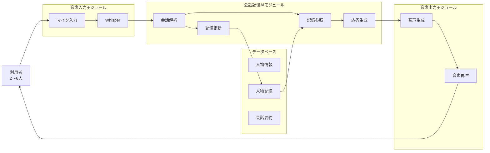
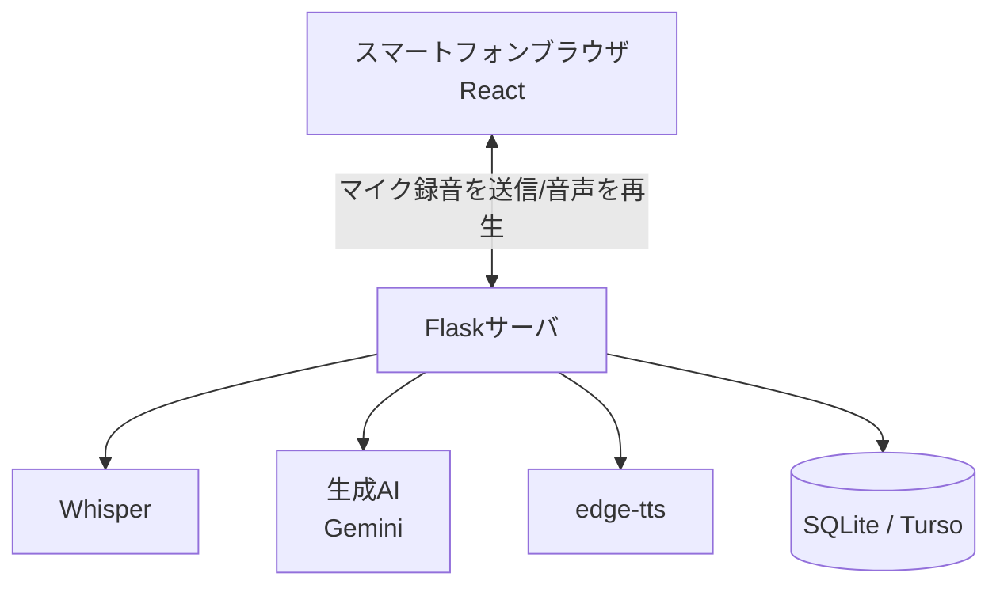
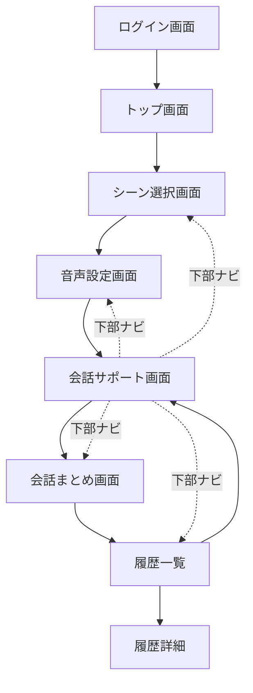
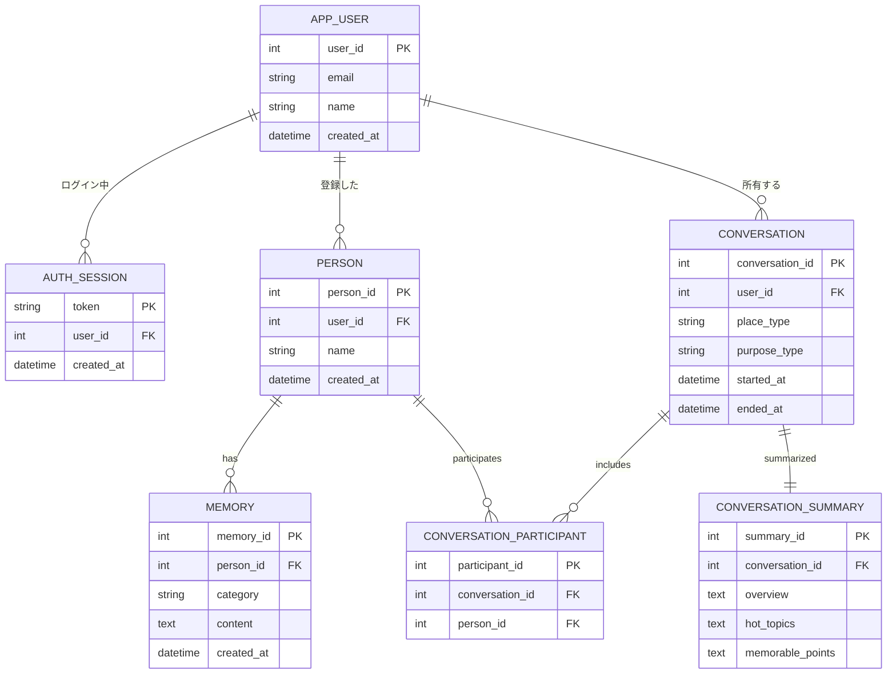

# AI会話支援システム「TalkSeed」 全体設計書

## 1. 文書情報

| 項目     | 内容           |
| ------ | ------------ |
| システム名  | TalkSeed（仮称） |
| 文書名    | 全体設計書        |
| 作成日    | 2026/06/23   |
| 作成者    | 開発チーム        |
| 対象システム | AI会話支援システム   |

---

# 2. システム概要

## 2.1 システム概要

TalkSeedは、待ち時間における利用者同士の会話を支援するAI会話システムである。

利用者の会話を音声認識によって取得し、AIが会話内容や過去の会話履歴を理解して質問、リアクション、共感表現、エピソードトークを生成する。

また、利用者に関する情報を記憶し、次回以降の会話で活用することで、人間関係の継続的な形成を支援する。

会話終了後には会話内容を要約し、会話履歴として保存する。

---

# 3. システム構成


## 3.1 システム構成図



上図は会話支援の中心フローを表す概念図。実装ではこの手前にログイン（事前登録メールアドレスまたはゲスト）によるユーザー識別があり、データベースはユーザーごとに人物情報・記憶・会話履歴を分離して保持する（詳細は7章ER図を参照）。

---

# 4. システムアーキテクチャ

## 4.1 構成方式



クライアント(React)はマイクボタン押下時に録音した音声ファイルをサーバーへ送信し、サーバー側でWhisperによる文字起こし・Geminiによる応答生成・edge-ttsによる音声合成をすべて行う。合成音声(mp3, base64)はクライアントへ返却され、ブラウザの`<audio>`要素で再生する。

DBは環境変数`TURSO_DATABASE_URL`の有無で接続先を自動的に切り替える（未設定時はローカルSQLite、設定時はTurso/libSQL）。デプロイ構成は、バックエンドをHugging Face Spaces（Docker）、フロントエンドをVercelに置く想定（詳細は[README.md](../README.md)を参照）。

---

# 5. モジュール設計

## 5.1 音声入力モジュール

### 役割

利用者の会話音声を取得しテキストへ変換する。

### 入力

* マイク音声

### 出力

* 発話テキスト

### 使用技術

* Whisper

---

## 5.2 会話支援AIモジュール

### 役割

会話内容と過去の記憶を利用して自然な会話を生成する。

### 主な処理（実装）

- 参加者ごとの過去の記憶（MEMORY）をDBから取得し、システムプロンプトへ組み込む
- `gemini-flash-lite-latest`への1回の呼び出しで応答テキストを生成する（話題提案・深掘り質問・共感表現などを個別の関数には分けず、プロンプト指示のみで制御）
- 応答は「1〜2文の短い音声出力向けの文章」になるよう`max_output_tokens=120`で制限
- 503エラー時は1回だけ自動リトライ、それでも失敗した場合は固定の代替メッセージを返す
- ログイン済みユーザー: `generate_ai_response` / `generate_conversation_summary`（DBの記憶を参照・更新）
- ゲスト: `generate_ai_response_stateless` / `generate_guest_summary`（DBを一切参照・更新しない）
- 会話終了時（`/conversation/end`）にフロントから渡された発話ログをまとめてGeminiへ渡し、要約と人物記憶の更新候補をJSON形式で一括生成する

### 入力

- 発話テキスト（現在の1発話。ログイン済みなら`conversation_id`、ゲストなら参加者名を都度渡す）
- 人物記憶（DBから取得。ゲストは無し）
- 会話終了時のみ：発話ログ全体（フロントエンドが保持している`transcript`）

### 出力

- AI応答テキスト（`/conversation/respond`）
- 会話要約・人物記憶の更新候補（`/conversation/end`）

---

## 5.2.1 認証モジュール（実装で追加）

### 役割

事前登録メールアドレスによるログイン、およびゲストログインを扱う。

### 主な処理

- `APP_USER`テーブルとメールアドレスの照合
- ログイントークンの発行・`AUTH_SESSION`への保存
- 全APIエンドポイントでの`Authorization: Bearer <token>`検証（`require_auth`デコレータ）
- `GUEST_`プレフィックス付きトークンによるゲスト判定（DBに一切書き込まない）

### 入力

- メールアドレス（ログイン時）、またはゲストログインのリクエスト
- 各APIリクエストの`Authorization`ヘッダ

### 出力

- ログイントークン
- リクエストごとのユーザーID（またはゲスト判定）

---

## 5.3 音声出力モジュール

### 役割

AI応答を音声へ変換する。

### 入力

* AI応答テキスト

### 出力

* AI音声

### 使用技術

* edge-tts（サーバーサイドでmp3を生成しbase64で返却。詳細は[音声出力処理_minekiti.md](./音声出力処理_minekiti.md)を参照）

---


## 5.4 履歴管理モジュール

### 役割

会話要約と人物記憶を保存する。会話全文（発話ログ）はDBに保存しない。

### 主な処理（実装）

- 会話要約生成・保存（`CONVERSATION_SUMMARY`。会話終了ごとに既存行を削除してから再INSERT）
- 人物記憶の保存（`MEMORY`。要約生成時にGeminiが提案した内容のうち、今回の参加者名と一致するものだけを保存）
- 履歴の一覧取得・詳細取得（ユーザーごとに`CONVERSATION.user_id`でフィルタし、他ユーザーのデータは参照不可）
- 履歴の削除（`CONVERSATION`をDELETEすると、外部キーのON DELETE CASCADEで`CONVERSATION_PARTICIPANT`・`CONVERSATION_SUMMARY`も連動して削除される）
- 参加者名の後編集（`CONVERSATION_PARTICIPANT`を一度全削除し、入力された名前で`PERSON`を検索または新規作成して再登録）
- ゲストの場合はこれらの処理を一切行わない（要約はその場で生成して返すのみ）

---

# 6. 画面設計

## 6.1 画面一覧

実装では、UI/UX設計（[UI_UX_Yuki.md](./UI_UX_Yuki.md)）に基づき、以下の8状態（React側の`Screen`型）で画面を管理している。

|画面ID|画面名|備考|
|---|---|---|
|SCR-00|ログイン画面|事前登録メールアドレス、またはゲストログイン|
|SCR-01|トップ画面||
|SCR-02|シーン選択画面|場所・関係性・気分・参加者名を入力|
|SCR-03|音声設定画面|初回セットアップ時に表示。以降は下部ナビ「設定」から変更可|
|SCR-04|会話サポート画面|話題表示・マイク発話・会話記録（記録中は同画面内でREC表示に切り替え）|
|SCR-05|会話まとめ画面||
|SCR-06|履歴一覧画面||
|SCR-07|履歴詳細画面|参加者名の後編集、履歴削除|

---

## 6.2 画面遷移図



初回セットアップ完了後（音声設定を保存して会話を開始した後）は、下部ナビゲーションから シーン／会話／まとめ／履歴／設定 の各画面へ自由に行き来できる。

---

# 7. データベース設計

## 7.1 ER図

ログイン機能の追加に伴い、`APP_USER`・`AUTH_SESSION`を追加し、`PERSON`・`CONVERSATION`はユーザーごとに所有者（`user_id`）を持つ構成にしている（実装: [schema.sql](../backend/database/schema.sql)）。全テーブルとも外部キーに`ON DELETE CASCADE`を設定しており、ユーザーや会話を削除すると関連レコードも連動して削除される。



ゲストログイン時は`APP_USER`・`AUTH_SESSION`のどちらにも行を作らず、会話に関するテーブルへの書き込みも一切行わない。

---

# 8. API設計（実装。[app.py](../backend/api/app.py)に準拠）

`/auth/guest-login` `/auth/login` 以外のすべてのエンドポイントは `Authorization: Bearer <token>` ヘッダによる認証が必須で、未指定・無効なトークンの場合は `401 {"error": "unauthorized"}` を返す。トークンが `GUEST_` から始まる場合はゲスト扱いとなり、DBへの読み書きを一切行わずその場限りの応答を返す。

## 8.1 ゲストログインAPI

### Request

```http
POST /auth/guest-login
```

### Response

```json
{
  "token": "GUEST_xxxxxxxxxxxxxxxxxxxxxxxxxxxxxxxxxxxxxxxxxxx",
  "name": "ゲスト",
  "email": null,
  "is_guest": true
}
```

---

## 8.2 ログインAPI

事前に`APP_USER`へ登録されたメールアドレスのみログインできる。パスワードは無い。

### Request

```http
POST /auth/login
```

```json
{
  "email": "member@example.com"
}
```

### Response

```json
{
  "token": "xxxxxxxxxxxxxxxxxxxxxxxxxxxxxxxxxxxxxxxxxxx",
  "name": "メンバーの名前",
  "email": "member@example.com"
}
```

未登録のメールアドレスの場合は `401 {"error": "このメールアドレスは登録されていません"}` を返す。

---

## 8.3 ログアウトAPI

### Request

```http
POST /auth/logout
Authorization: Bearer <token>
```

### Response

```json
{
  "logged_out": true
}
```

サーバー側の`AUTH_SESSION`からトークンを削除する。

---

## 8.4 会話開始API

### Request

```http
POST /conversation/start
Authorization: Bearer <token>
```

```json
{
  "place_type": "飲食店",
  "purpose_type": "盛り上げたい",
  "participants": ["山田", "鈴木"]
}
```

`participants`は既存の`PERSON`（同名・同ユーザー）があれば再利用し、無ければ新規登録する。ゲストの場合はDBへ書き込まず、常に`conversation_id: 0`を返す（以降の応答生成・終了APIは`conversation_id`を使わない）。

### Response

```json
{
  "conversation_id": 15
}
```

---

## 8.5 AI応答生成API

### Request

```http
POST /conversation/respond
Authorization: Bearer <token>
```

```json
{
  "conversation_id": 15,
  "current_text": "京都旅行に行ってきた",
  "participants": ["山田", "鈴木"]
}
```

`participants`はゲスト時のステートレス応答生成にのみ使用する（ログイン済みユーザーは`conversation_id`からDB上の参加者・記憶を参照するため、実質未使用）。

### Response

```json
{
  "response": "京都いいですね。前回も旅行の話をされていましたよね。今回はどこが一番印象に残りましたか？"
}
```

---

## 8.6 会話終了API

### Request

```http
POST /conversation/end
Authorization: Bearer <token>
```

```json
{
  "conversation_id": 15,
  "transcript": [
    { "role": "user", "content": "最近旅行行った？" },
    { "role": "ai", "content": "京都いいですね。" }
  ],
  "participants": ["山田", "鈴木"]
}
```

`transcript`はフロントエンドがブラウザ上で保持していた発話ログで、DBには保存されない（要約生成のためだけに一度だけ使われる）。会話全文はサーバーにも残らない。ログイン済みユーザーの場合、要約と合わせて人物記憶（MEMORY）の更新候補もGeminiが提案し、参加者名と一致するものだけが保存される。ゲストの場合は要約のみをその場で生成して返し、DBへの保存（`memory_updated`は常に`false`）は行わない。

### Response

```json
{
  "summary_created": true,
  "memory_updated": true,
  "overview": "会話全体の概要",
  "hot_topics": "話題1、話題2、話題3",
  "memorable_points": "印象に残った内容"
}
```

---

## 8.7 履歴一覧取得API

### Request

```http
GET /conversations
Authorization: Bearer <token>
```

ログイン中ユーザー自身の会話のみを`conversation_id`の降順で返す。ゲストの場合は常に空配列`[]`を返す。

### Response

```json
[
  {
    "conversation_id": 15,
    "date": "2026-06-23",
    "overview": "旅行と就活の話題",
    "participants": ["山田", "鈴木"]
  }
]
```

---

## 8.8 履歴詳細取得API

### Request

```http
GET /conversations/{conversation_id}
Authorization: Bearer <token>
```

指定した`conversation_id`の所有者がログイン中ユーザーでない場合は`404 {"error": "not found"}`を返す（他ユーザーの履歴は参照不可）。ゲストは常に`404`。

### Response

```json
{
  "overview": "...",
  "hot_topics": "...",
  "memorable_points": "...",
  "participants": ["山田", "鈴木"]
}
```

---

## 8.9 参加者名の編集API

会話中に取得できなかった参加者の実名を、あとから履歴詳細画面で記録・修正するためのAPI。

### Request

```http
PUT /conversations/{conversation_id}/participants
Authorization: Bearer <token>
```

```json
{
  "participants": ["山田花子", "鈴木太郎"]
}
```

既存の参加者登録を一度すべて削除し、入力された名前で`PERSON`を検索（無ければ新規作成）してから再登録する。

### Response

```json
{
  "participants": ["山田花子", "鈴木太郎"]
}
```

`GET /conversations` および `GET /conversations/{conversation_id}` のレスポンスにも `participants` (名前の配列) を含める。

---

## 8.10 会話履歴削除API

### Request

```http
DELETE /conversations/{conversation_id}
Authorization: Bearer <token>
```

所有者チェックはF-08と同様。`CONVERSATION`を削除すると、外部キーのON DELETE CASCADEにより`CONVERSATION_PARTICIPANT`・`CONVERSATION_SUMMARY`も連動して削除される。

### Response

```json
{
  "deleted": true
}
```

---

## 8.11 音声認識API (プッシュトゥトーク)

マイクボタンで録音した音声ファイルをWhisper(baseモデル)で文字起こしする。

### Request

```http
POST /voice/transcribe
Authorization: Bearer <token>
Content-Type: multipart/form-data
```

| フィールド | 内容 |
|---|---|
| audio | 録音した音声ファイル(webm) |

### Response

```json
{
  "text": "こんにちは、今日はいい天気ですね"
}
```

---

## 8.12 音声合成API

テキストをedge-ttsで音声化し、base64エンコードしたmp3を返す。

### Request

```http
POST /voice/speak
Authorization: Bearer <token>
```

```json
{
  "text": "AIの応答テキスト",
  "voice_type": "female"
}
```

`voice_type`は `female`（ja-JP-NanamiNeural） / `male`（ja-JP-KeitaNeural） のいずれか。未指定・不明な値の場合は`female`にフォールバックする（`robot`は過去に実装されていたが削除済み）。

### Response

```json
{
  "audio_base64": "..."
}
```

---

# 9. 非機能設計

## 性能

|項目|目標値|実測値(開発環境)|
|---|---|---|
|音声認識|2秒以内|約1.3秒|
|AI応答生成|5秒以内|約0.7〜1.3秒|
|音声生成|3秒以内|約1秒|
|連続利用|30分以上|-|

---

## セキュリティ

- 録音開始は利用者操作必須（プッシュトゥトーク）
- 会話履歴削除機能
- 会話全文はDBに保存せず、AI生成の要約のみ保持（ゲストは要約も含め一切保存しない）
- 全API（ログイン系を除く）で`Authorization: Bearer`トークンによる認証必須。会話履歴はユーザーごとに`user_id`で分離し、他ユーザーのデータは参照不可
- ログインはパスワードなしの簡易方式のため、信頼できる小規模グループでの利用を前提とする（不特定多数へは公開しない運用を想定）
- 個人のメールアドレスはGit管理下のファイルに書かない（`backend/database/local_users.sql`はGit管理外）
- スマートフォン実機からのマイク利用のため、mkcertによるローカルHTTPS、および本番デプロイ時はHTTPS通信を利用

---

## 可用性

- エラー時もシステム停止しない
- 音声認識失敗時は再試行可能
- 開発時はローカルSQLite、本番はTurso（永続クラウドDB）に接続先を切り替え、コンテナ再起動によるデータ消失を回避

---

# 10. 今後の課題

- パスワード認証・二要素認証の追加（現状は登録済みメールアドレスを知っていればログインできる簡易認証）
- テスト仕様書・評価指標／受入試験仕様書の整備
- 各モジュールの詳細設計は、実装に合わせて以下の担当者別ドキュメントに集約済み
  - 音声入力モジュール: [音声入力処理_edsheeran.md](./音声入力処理_edsheeran.md)
  - 音声出力モジュール: [音声出力処理_minekiti.md](./音声出力処理_minekiti.md)
  - UI/UX: [UI_UX_Yuki.md](./UI_UX_Yuki.md)