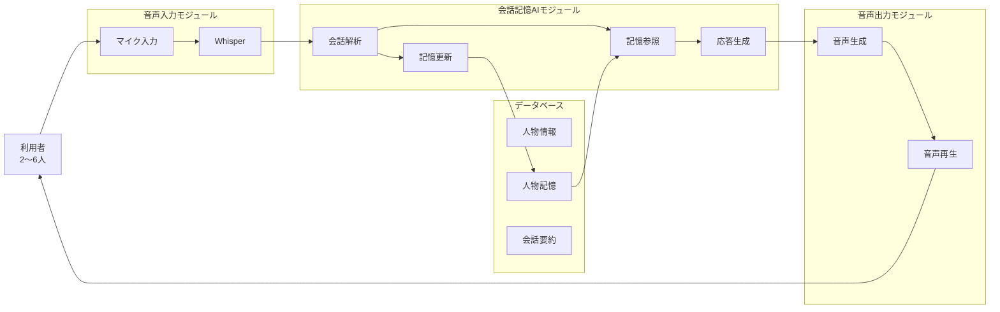
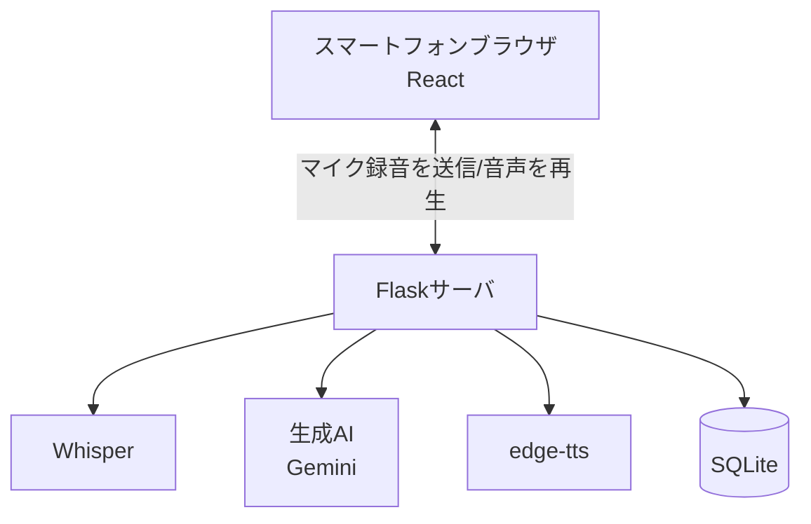
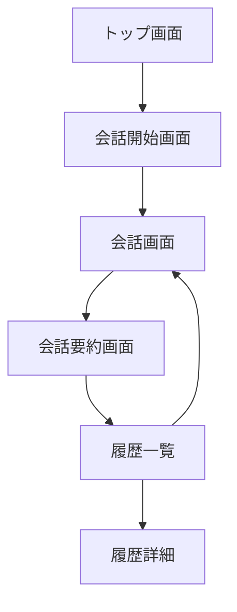
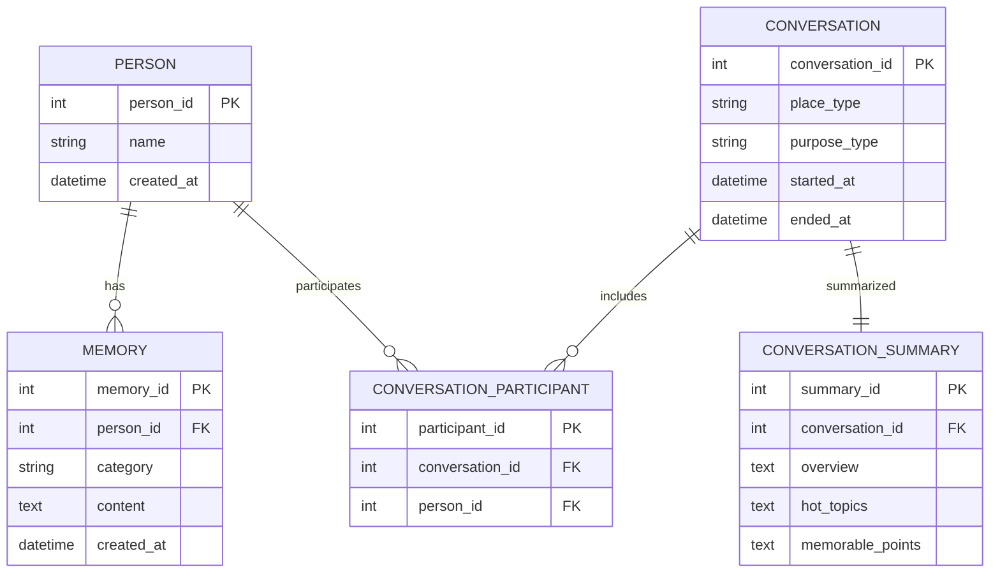

# AI会話支援システム「TalkSeed」 全体設計書

## 1. 文書情報

| 項目     | 内容           |
| ------ | ------------ |
| システム名  | TalkSeed（仮称） |
| 文書名    | 全体設計書        |
| 作成日    | 2026/06/23   |
| 作成者    | 開発チーム        |
| 対象システム | AI会話支援システム   |

---

# 2. システム概要

## 2.1 システム概要

TalkSeedは、待ち時間における利用者同士の会話を支援するAI会話システムである。

利用者の会話を音声認識によって取得し、AIが会話内容や過去の会話履歴を理解して質問、リアクション、共感表現、エピソードトークを生成する。

また、利用者に関する情報を記憶し、次回以降の会話で活用することで、人間関係の継続的な形成を支援する。

会話終了後には会話内容を要約し、会話履歴として保存する。

---

# 3. システム構成


## 3.1 システム構成図



---

# 4. システムアーキテクチャ

## 4.1 構成方式



クライアント(React)はマイクボタン押下時に録音した音声ファイルをサーバーへ送信し、サーバー側でWhisperによる文字起こし・Geminiによる応答生成・edge-ttsによる音声合成をすべて行う。合成音声(mp3, base64)はクライアントへ返却され、ブラウザの`<audio>`要素で再生する。

---

# 5. モジュール設計

## 5.1 音声入力モジュール

### 役割

利用者の会話音声を取得しテキストへ変換する。

### 入力

* マイク音声

### 出力

* 発話テキスト

### 使用技術

* Whisper

---

## 5.2 会話支援AIモジュール

### 役割

会話内容と過去の記憶を利用して自然な会話を生成する。

### 主な処理

- 文脈理解
- 人物記憶参照
- 話題提案
- 深掘り質問
- 共感表現生成
- エピソードトーク生成
- 人物情報抽出
- 記憶更新

### 入力

- 発話テキスト
- 人物記憶
- 会話履歴

### 出力

- AI応答テキスト

---

## 5.3 音声出力モジュール

### 役割

AI応答を音声へ変換する。

### 入力

* AI応答テキスト

### 出力

* AI音声

### 使用技術

* VOICEVOX
* Web Speech API

---


## 5.4 履歴管理モジュール

### 役割

会話要約と人物記憶を保存する。

### 主な処理

- 会話要約生成
- 人物記憶保存
- 履歴検索

---

# 6. 画面設計

## 6.1 画面一覧

|画面ID|画面名|
|---|---|
|SCR-01|トップ画面|
|SCR-02|会話開始画面|
|SCR-03|会話画面|
|SCR-04|会話要約画面|
|SCR-05|履歴一覧画面|
|SCR-06|履歴詳細画面|

---

## 6.2 画面遷移図



---

# 7. データベース設計

## 7.1 ER図



---

# 8. API設計

## 8.1 会話開始API

### Request

```http
POST /conversation/start
```

```json
{
  "place_type": "cafe",
  "purpose_type": "friend_chat",
  "participants": [
    "山田",
    "鈴木"
  ]
}
```

### Response

```json
{
  "conversation_id": 15
}
```

---

## 8.2 AI応答生成API

### Request

```http
POST /conversation/respond
```

```json
{
  "conversation_id": 15,
  "current_text": "京都旅行に行ってきた"
}
```

### Response

```json
{
  "response": "京都いいですね。前回も旅行の話をされていましたよね。今回はどこが一番印象に残りましたか？"
}
```

---

## 8.3 会話終了API

### Request

```http
POST /conversation/end
```

```json
{
  "conversation_id": 15
}
```

### Response

```json
{
  "summary_created": true,
  "memory_updated": true
}
```

---

## 8.4 履歴一覧取得API

### Request

```http
GET /conversations
```

### Response

```json
[
  {
    "conversation_id": 15,
    "date": "2026-06-23",
    "overview": "旅行と就活の話題"
  }
]
```

---

## 8.5 履歴詳細取得API

### Request

```http
GET /conversations/{conversation_id}
```

### Response

```json
{
  "overview": "...",
  "hot_topics": "...",
  "memorable_points": "..."
}
```

---

## 8.6 音声認識API (プッシュトゥトーク)

マイクボタンで録音した音声ファイルをWhisperで文字起こしする。

### Request

```http
POST /voice/transcribe
Content-Type: multipart/form-data
```

| フィールド | 内容 |
|---|---|
| audio | 録音した音声ファイル(webm等) |

### Response

```json
{
  "text": "こんにちは、今日はいい天気ですね"
}
```

---

## 8.7 音声合成API

テキストをedge-ttsで音声化し、base64エンコードしたmp3を返す。

### Request

```http
POST /voice/speak
```

```json
{
  "text": "AIの応答テキスト",
  "voice_type": "female"
}
```

`voice_type`は `female` / `male` / `robot` のいずれか。

### Response

```json
{
  "audio_base64": "..."
}
```

---

## 8.8 参加者名の編集API

会話中に取得できなかった参加者の実名を、あとから履歴詳細画面で記録・修正するためのAPI。

### Request

```http
PUT /conversations/{conversation_id}/participants
```

```json
{
  "participants": ["山田花子", "鈴木太郎"]
}
```

### Response

```json
{
  "participants": ["山田花子", "鈴木太郎"]
}
```

`GET /conversations` および `GET /conversations/{conversation_id}` のレスポンスにも `participants` (名前の配列) を含める。

---

# 9. 非機能設計

## 性能

|項目|目標値|実測値(開発環境)|
|---|---|---|
|音声認識|2秒以内|約1.3秒|
|AI応答生成|5秒以内|約0.7〜1.3秒|
|音声生成|3秒以内|約1秒|
|連続利用|30分以上|-|

---

## セキュリティ

- 録音開始は利用者操作必須
- 会話履歴削除機能
- HTTPS通信

---

## 可用性

- エラー時もシステム停止しない
- 音声認識失敗時は再試行可能

---

# 10. 今後作成する詳細設計書

- 音声入力モジュール詳細設計書
- 会話記憶AIモジュール詳細設計書
- 音声出力モジュール詳細設計書
- 履歴管理モジュール詳細設計書
- API詳細設計書
- テスト仕様書
- 評価指標・受入試験仕様書