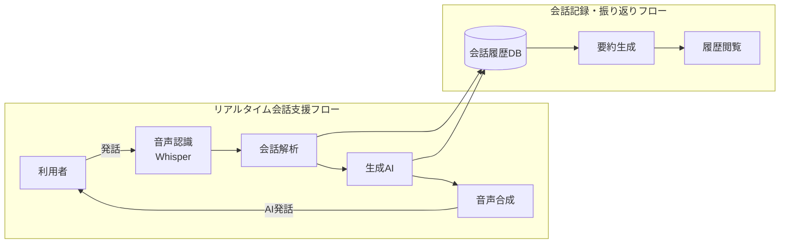

# AI会話支援システム「TalkSeed」 要件定義書

## 1. システム概要

### システム名

TalkSeed（仮称）

### システム概要

TalkSeedは、飲食店やテーマパーク、イベント会場などの待ち時間において、会話が途切れてしまう利用者同士のコミュニケーションを支援するAI会話システムである。

利用者同士の会話を音声認識によって取得し、AIが会話内容や場面に応じて話題提供、質問、リアクション、エピソードトークなどを行うことで、自然な会話の進行を支援する。

また、会話内容を記録し、要約や議事録形式で保存する機能を提供する。

---

# 2. 背景・課題

飲食店やテーマパーク、イベント会場などでは長時間の待ち時間が発生する場合がある。

友人、恋人、家族などと待機している際、会話の話題が尽きてしまい、それぞれがスマートフォンを閲覧するだけの状態になることが少なくない。

特に頻繁に会う関係性では新しい話題が生まれにくく、会話が停滞しやすい。

そこで本システムは、AIを会話参加者として介在させることで、待ち時間をより有意義で楽しいコミュニケーションの時間へ変えることを目的とする。

---

# 3. システム目的

本システムは以下を実現することを目的とする。

* 待ち時間における退屈さの軽減
* 会話のきっかけの創出
* 会話の継続支援
* グループ内コミュニケーションの活性化
* 会話内容の記録・振り返り

---

# 4. 想定利用者

## 利用対象

* 友人同士
* 恋人
* 家族
* 初対面のグループ
* イベント参加者

## 利用人数

2人～6人程度

## 利用シーン

* 飲食店の待ち時間
* テーマパークの待機列
* ライブ会場
* イベント会場
* 移動時間
* 旅行中

---

# 5. システム構成

---

# 6. AIの役割

本システムのAIは単なる話題提供ツールではなく、会話参加者として振る舞う。

## AIが行う内容

* 会話内容の理解
* 話題提案
* 深掘り質問
* 相づち
* リアクション
* 共感表現
* 自己開示風の発言
* エピソードトーク生成
* 話題転換
* 会話の活性化

## 発話例

利用者：
「最近旅行行った？」

利用者：
「京都行ったよ」

AI：
「京都いいですね。私は実際には旅行できませんが、京都なら清水寺や嵐山の話題を聞くことが多いです。何が一番印象に残りましたか？」

---

# 7. 機能要件

## F-01 音声取得機能

利用者全員の会話音声をスマートフォンのマイクから取得する。

### 入力

* 利用者の音声

### 出力

* 音声データ

---

## F-02 音声認識機能

取得した音声をテキストへ変換する。

### 技術候補

* Whisper

### 出力

* 認識済みテキスト

---

## F-03 会話解析機能

会話内容を解析する。

### 処理内容

* 話題抽出
* 感情分析
* 会話状況把握
* 発話履歴管理

---

## F-04 AI応答生成機能

会話内容をもとにAI発話を生成する。

### 応答種別

* 質問
* リアクション
* 共感
* 話題提案
* 雑談
* エピソード生成

---

## F-05 音声合成機能

AI発話を自然音声へ変換する。

### 設定項目

* 音声タイプ
* 音量
* 話速

---

## F-06 音声出力機能

生成した音声を再生する。

### 操作

* 再生
* 停止
* 再生完了通知

---

## F-07 会話記録機能

会話内容を保存する。

### 保存内容

* 会話全文
* AI応答
* 利用日時
* シーン情報

---

## F-08 会話要約機能

保存した会話を要約する。

### 出力内容

* 要約
* キーワード
* 盛り上がった話題
* 次回おすすめ話題

---

## F-09 履歴閲覧機能

過去の会話記録を確認する。

### 表示内容

* 日付
* 場所
* 要約
* 会話詳細

---

# 8. 非機能要件

## 性能

| 項目     | 要件        |
| ------ | --------- |
| 音声認識   | 発話終了後2秒以内 |
| 音声生成   | 3秒以内      |
| AI応答生成 | 5秒以内      |
| 連続利用時間 | 30分以上     |

---

## 可用性

* エラー発生時もシステム停止しない
* 音声認識失敗時は再試行可能

---

## 操作性

* スマートフォン対応
* Webブラウザのみで利用可能
* インストール不要

---

## セキュリティ

* 録音は利用者操作時のみ開始
* 会話履歴削除機能を提供
* 個人情報保護に配慮

---

# 9. 画面一覧

| 画面ID   | 画面名      |
| ------ | -------- |
| SCR-01 | トップ画面    |
| SCR-02 | シーン選択画面  |
| SCR-03 | 会話サポート画面 |
| SCR-04 | 会話まとめ画面  |
| SCR-05 | 履歴画面     |

---

# 10. ユースケース

## UC-01 会話支援利用

1. 利用者がシーンを選択
2. AIが初回話題を生成
3. 利用者が会話
4. AIが会話へ参加
5. AIが適宜応答
6. 会話を継続

---

## UC-02 会話保存

1. 利用者が記録開始
2. 音声認識開始
3. 会話を保存
4. 記録終了
5. AI要約生成
6. 履歴保存

---

## UC-03 会話履歴確認

1. 履歴画面を開く
2. 過去会話を選択
3. 要約を確認
4. 詳細を閲覧

---

# 11. 開発環境

| 項目      | 内容                          |
| ------- | --------------------------- |
| 開発言語    | Python                      |
| フロントエンド | HTML/CSS/JavaScript → Reactになるかも？|
| バックエンド  | Flask                       |
| 音声認識    | Whisper                     |
| 音声合成    | Web Speech API または VOICEVOX |
| 生成AI    | OpenAI API等                 |
| データ形式   | JSON                        |

---

# 12. 開発範囲

## 実装対象

* 音声認識(STT)
* AI会話生成
* 音声合成(TTS)
* 会話履歴保存
* 会話要約
* スマホ向けUI

## 実装対象外

* ユーザー登録
* SNS機能
* 他端末同期
* アカウント管理
* 多言語対応

---

# 13. 成功指標

本システムは以下を達成できた場合に成功と判断する。

* AIが会話へ自然に参加できる
* 利用者同士の会話時間が増加する
* 利用者が待ち時間を退屈と感じにくくなる
* 会話履歴を振り返ることができる
* グループワーク期間内に動作するプロトタイプを完成できる
