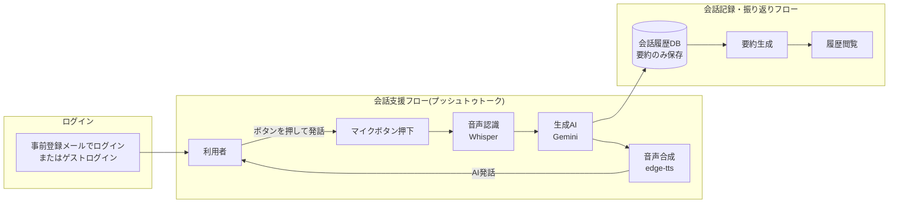

# AI会話支援システム「TalkSeed」 要件定義書

## 1. システム概要

### システム名

TalkSeed（仮称）

### システム概要

TalkSeedは、飲食店やテーマパーク、イベント会場などの待ち時間において、会話が途切れてしまう利用者同士のコミュニケーションを支援するAI会話システムである。

利用者同士の会話を音声認識によって取得し、AIが会話内容や場面に応じて話題提供、質問、リアクション、エピソードトークなどを行うことで、自然な会話の進行を支援する。

また、会話内容を記録し、要約や議事録形式で保存する機能を提供する。

---

# 2. 背景・課題

飲食店やテーマパーク、イベント会場などでは長時間の待ち時間が発生する場合がある。

友人、恋人、家族などと待機している際、会話の話題が尽きてしまい、それぞれがスマートフォンを閲覧するだけの状態になることが少なくない。

特に頻繁に会う関係性では新しい話題が生まれにくく、会話が停滞しやすい。

そこで本システムは、AIを会話参加者として介在させることで、待ち時間をより有意義で楽しいコミュニケーションの時間へ変えることを目的とする。

---

# 3. システム目的

本システムは以下を実現することを目的とする。

* 待ち時間における退屈さの軽減
* 会話のきっかけの創出
* 会話の継続支援
* グループ内コミュニケーションの活性化
* 会話内容の記録・振り返り

---

# 4. 想定利用者

## 利用対象

* 友人同士
* 恋人
* 家族
* 初対面のグループ
* イベント参加者

## 利用人数

2人～6人程度

## 利用シーン

* 飲食店の待ち時間
* テーマパークの待機列
* ライブ会場
* イベント会場
* 移動時間
* 旅行中

---

# 5. システム構成

利用者が発話するたびにマイクボタンを押して録音・停止する方式（プッシュトゥトーク）を採用している。常時録音して無音区間を自動検出する方式は、応答待ち時間の体感悪化とプロトタイプ開発期間の制約を踏まえ採用していない。

ログインは事前にAPP_USERテーブルへ登録されたメールアドレスを入力するだけの簡易方式（パスワードなし）で、登録なしでその場で試せる「ゲストログイン」も用意している。ゲストの会話・記憶・履歴はDBに一切保存されない。

---

# 6. AIの役割

本システムのAIは単なる話題提供ツールではなく、会話参加者として振る舞う。

## AIが行う内容

* 会話内容の理解
* 話題提案
* 深掘り質問
* 相づち
* リアクション
* 共感表現
* 自己開示風の発言
* エピソードトーク生成
* 話題転換
* 会話の活性化

## 発話例

利用者：
「最近旅行行った？」

利用者：
「京都行ったよ」

AI：
「京都いいですね。私は実際には旅行できませんが、京都なら清水寺や嵐山の話題を聞くことが多いです。何が一番印象に残りましたか？」

---

# 7. 機能要件

## F-01 音声取得機能

利用者全員の会話音声をスマートフォンのマイクから取得する。

### 入力

* 利用者の音声

### 出力

* 音声データ

---

## F-02 音声認識機能

取得した音声をテキストへ変換する。

### 技術候補

* Whisper

### 出力

* 認識済みテキスト

---

## F-03 会話解析機能

会話内容を解析する。

### 処理内容（実装）

独立した解析処理は設けず、以下をAI応答生成機能（F-04）のプロンプトに組み込むことで、実質的な会話状況の把握を行っている。

* 参加者ごとの過去の記憶（MEMORY）をプロンプトへ組み込み、文脈として利用
* 直近の発話テキストをそのままGeminiへ渡し、応答生成と合わせて内容理解を行わせる
* 発話履歴（transcript）はフロントエンド側（ブラウザのメモリ上）で保持し、会話終了時に要約生成へ渡す。DBには保存しない

話題抽出・感情分析を独立した関数として持つ設計ではなく、Gemini側の応答生成に委ねている。

---

## F-04 AI応答生成機能

会話内容をもとにAI発話を生成する。

### 応答種別

* 質問
* リアクション
* 共感
* 話題提案
* 雑談
* エピソード生成

### 実装

応答種別ごとに関数を分けるのではなく、`gemini-flash-lite-latest`への1回の呼び出しで、システムプロンプト（参加者名・過去の記憶を含む）に基づき「1〜2文の短い音声出力向けの文章」を生成させている。ログイン済みユーザーは`POST /conversation/respond`でDBの記憶を参照し、ゲストは記憶を参照しない（ステートレスな）応答生成に切り替わる。503エラー時は1回だけ自動リトライする。

---

## F-05 音声合成機能

AI発話を自然音声へ変換する。

### 設定項目

* 音声タイプ
* 音量
* 話速

---

## F-06 音声出力機能

生成した音声を再生する。

### 操作

* 再生
* 停止
* 再生完了通知

---

## F-07 会話記録機能

会話内容を保存する。

### 保存内容（実装）

プライバシーに配慮し、**会話全文（発話ログ）はDBに保存しない**。保存されるのは以下のみ。

* 会話の要約（overview / hot_topics / memorable_points。F-08参照）
* 参加者名
* シーン情報（場所・気分＝purpose_type）
* 開始日時・終了日時

発話ログ自体はフロントエンドのメモリ上にのみ保持され、`POST /conversation/end`で要約生成に使われた後は破棄される。ゲストログイン時はこの保存自体を行わず、要約もその場で表示するのみで消える。

---

## F-08 会話要約機能

保存した会話を要約する。

### 出力内容（実装）

会話終了時に発話ログをGeminiへ渡し、JSON形式で以下を一括生成する。

* 会話全体の概要（overview）
* 盛り上がった話題（hot_topics、3つ程度）
* 印象に残った内容（memorable_points）
* 人物記憶の更新候補（memories。参加者ごとの「趣味・好み・出来事」などをMEMORYテーブルへ追記）

「次回おすすめ話題」は要約APIの出力には含めていない（フロントエンドのモックデータとしては存在するが、実データには連動していない）。

---

## F-09 履歴閲覧機能

過去の会話記録を確認する。

### 表示内容

* 日付
* 場所
* 要約
* 会話詳細

### 付随する機能（実装）

* 履歴の削除（一覧画面・詳細画面の両方から削除可能）
* 参加者名の後編集（会話中に聞き取れなかった名前を、履歴詳細画面から追加・修正して保存できる）

---

## F-10 ログイン機能

事前に登録されたメールアドレスでログインする。

### 概要（実装）

* アカウント作成機能は無く、`APP_USER`テーブルへ事前登録されたメールアドレスのみログインできる
* パスワードは無く、メールアドレスを知っていれば誰でもそのユーザーとしてログインできる簡易実装（信頼できる小規模グループでの利用を想定）
* ログイン成功時にランダムなトークンを発行し`AUTH_SESSION`テーブルに保存、以降のAPIは`Authorization: Bearer <token>`ヘッダで認証する
* ユーザーごとに人物情報（PERSON）・記憶（MEMORY）・会話履歴（CONVERSATION）が分離される

---

## F-11 ゲストログイン機能

登録なしで機能を一通り試せるモード。

### 概要（実装）

* `"GUEST_"`から始まるトークンをその場で発行するだけで、`APP_USER`・`AUTH_SESSION`には何も登録しない
* 会話開始・応答生成・要約生成はすべてDBを参照しない「ステートレス」な処理に切り替わる（人物記憶は参照・更新されない）
* 会話履歴・要約はDBに一切保存されず、画面を離れると消える（ハッカソンなどでのデモ・体験目的）

---

# 8. 非機能要件

## 性能

| 項目     | 要件        |
| ------ | --------- |
| 音声認識   | マイクボタンを離してから2秒以内 |
| 音声生成   | 3秒以内      |
| AI応答生成 | 5秒以内      |
| 連続利用時間 | 30分以上     |

実測値（開発環境）: 音声認識 約1.3秒 / AI応答生成 約0.7〜1.3秒 / 音声生成 約1秒。

---

## 可用性

* エラー発生時もシステム停止しない
* 音声認識失敗時は再試行可能

---

## 操作性

* スマートフォン対応
* Webブラウザのみで利用可能
* インストール不要

---

## セキュリティ

* 録音は利用者操作時のみ開始
* 会話履歴削除機能を提供
* 個人情報保護に配慮

---

# 9. 画面一覧

実装では、下部ナビゲーション（シーン・会話・まとめ・履歴・設定）で会話サポート画面を中心に行き来できる構成となっている。

| 画面ID   | 画面名      | 備考 |
| ------ | -------- | --- |
| SCR-00 | ログイン画面   | 事前登録メールアドレスでのログイン、またはゲストログイン |
| SCR-01 | トップ画面    | |
| SCR-02 | シーン選択画面  | 場所・関係性・気分・相手の名前（複数人可）を入力 |
| SCR-03 | 音声設定画面   | 初回セットアップ時に表示。以降は下部ナビ「設定」からいつでも変更可 |
| SCR-04 | 会話サポート画面 | 話題表示・音声読み上げ・マイク発話・会話記録（同一画面内でREC表示に切り替え） |
| SCR-05 | 会話まとめ画面  | |
| SCR-06 | 履歴画面     | 履歴一覧・履歴詳細（参加者名の後編集、履歴削除を含む） |

---

# 10. ユースケース

## UC-00 ログイン

1. 利用者がログイン画面でメールアドレスを入力する（または「ゲストとして試す」を選ぶ）
2. サーバーが`APP_USER`テーブルを照合し、登録済みならトークンを発行する（ゲストの場合は照合せずその場でトークンを発行）
3. トップ画面へ遷移する

---

## UC-01 会話支援利用

1. 利用者がシーン（場所・関係性・気分）と相手の名前を選択・入力する
2. 音声設定画面で声のタイプ・音量・話速を選び、会話を開始する
3. AIが初回話題を生成し音声で読み上げる
4. 利用者がマイクボタンを押して発話し、再度押して録音を止める
5. AIが発話内容を認識し、応答を生成して音声で返す
6. 4〜5を繰り返して会話を継続する（「もう一度読む」「深掘り質問」「次の話題へ」でもAIとやり取り可能）

---

## UC-02 会話保存

1. 利用者が会話サポート画面内で「会話を記録する」を押す（画面遷移はせず、同画面内でREC表示に切り替わる）
2. 発話・応答のやり取りがブラウザのメモリ上に記録される（DBへの逐次保存は行わない）
3. 利用者が「記録を終了する」を押す
4. AIが記録内容から要約（概要・盛り上がった話題・印象に残った内容）と人物記憶の更新候補を生成する
5. 会話まとめ画面で「保存する」を押すと、要約のみがDBへ保存される（会話全文は保存しない。ゲストの場合はDBに一切保存されない）

---

## UC-03 会話履歴確認

1. 履歴画面を開く
2. 過去会話を選択
3. 要約を確認
4. 詳細を閲覧する。必要に応じて参加者名を追加・修正、または履歴自体を削除する

---

# 11. 開発環境

| 項目      | 内容                          |
| ------- | --------------------------- |
| 開発言語    | Python / TypeScript          |
| フロントエンド | React + Vite                |
| バックエンド  | Flask                       |
| 音声認識    | Whisper (openai-whisper, baseモデル, サーバーサイド) |
| 音声合成    | edge-tts (Microsoft Edge TTS, サーバーサイド生成) |
| 生成AI    | Google Gemini API (gemini-flash-lite-latest) |
| データベース  | SQLite（開発）／ Turso（libSQL、本番。`TURSO_DATABASE_URL`の有無で自動切替） |
| 認証      | 事前登録メールアドレス＋トークン方式（パスワードなし）、ゲストログイン |
| データ形式   | JSON（音声ファイルのみ multipart/form-data） |

---

# 12. 開発範囲

## 実装対象

* 音声認識(STT)
* AI会話生成（人物記憶を反映したパーソナライズ応答）
* 音声合成(TTS)
* ログイン（事前登録メールアドレス）・ゲストログイン
* 会話履歴保存・一覧閲覧・詳細閲覧・削除
* 会話要約・人物記憶の自動更新
* 参加者名の後編集
* スマホ向けUI、ローカルHTTPSでのスマホ実機アクセス
* Web上へのデプロイ構成（Hugging Face Spaces + Vercel + Turso）

## 実装対象外

* アカウント作成（登録は事前登録制で、アプリ側からの新規登録は不可）
* パスワード認証・二要素認証
* SNS機能
* 他端末同期（同一アカウントでの複数端末同時利用の考慮）
* 多言語対応

---

# 13. 成功指標

本システムは以下を達成できた場合に成功と判断する。

* AIが会話へ自然に参加できる
* 利用者同士の会話時間が増加する
* 利用者が待ち時間を退屈と感じにくくなる
* 会話履歴を振り返ることができる
* グループワーク期間内に動作するプロトタイプを完成できる
